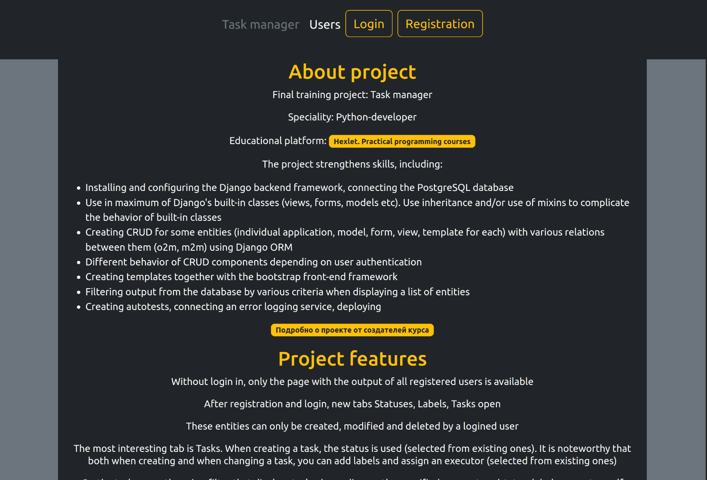
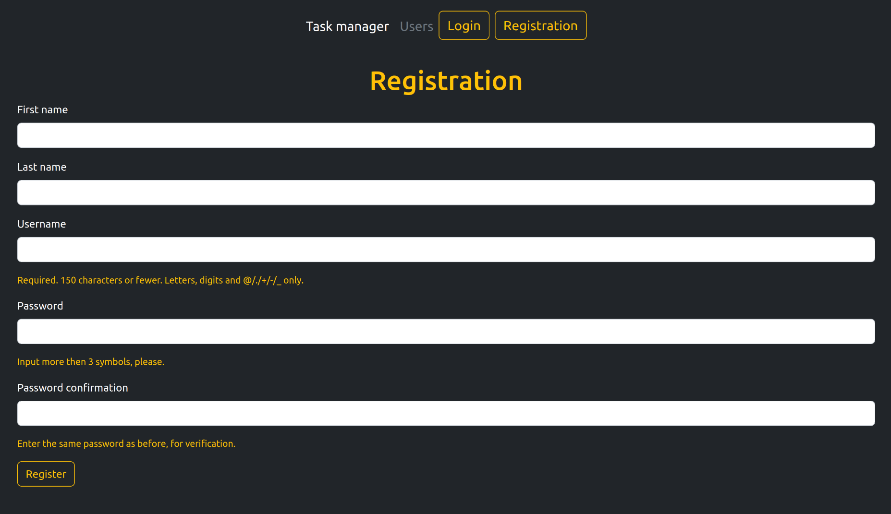
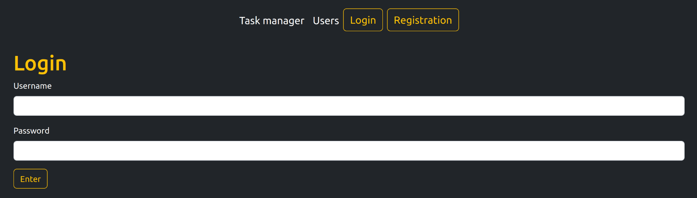
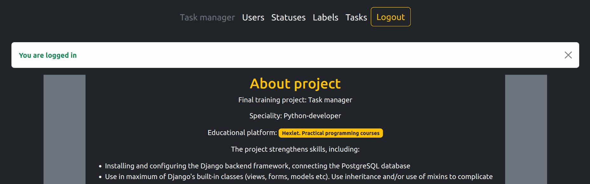
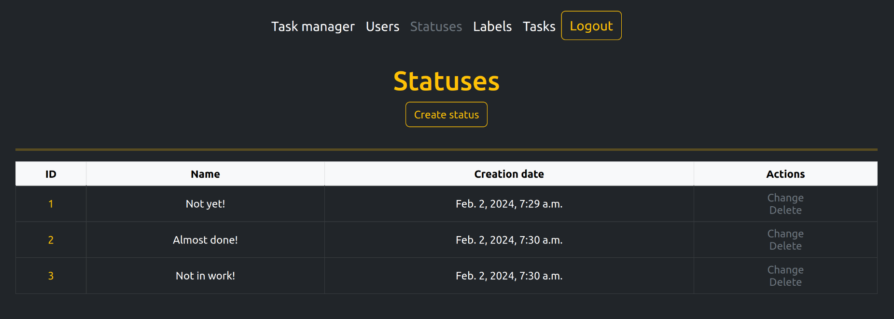
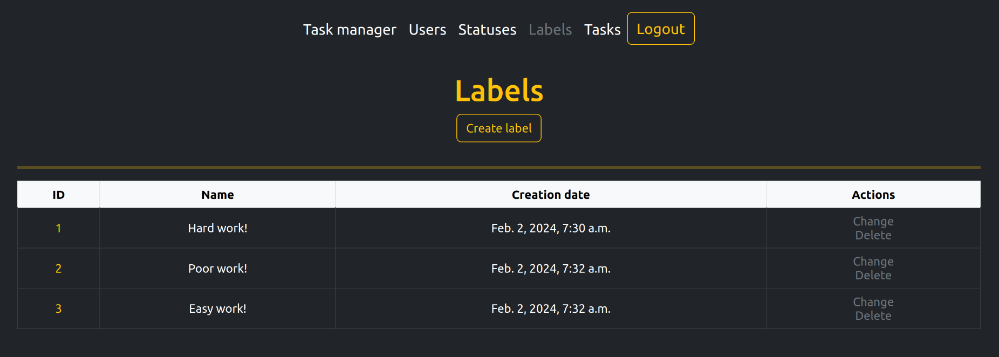
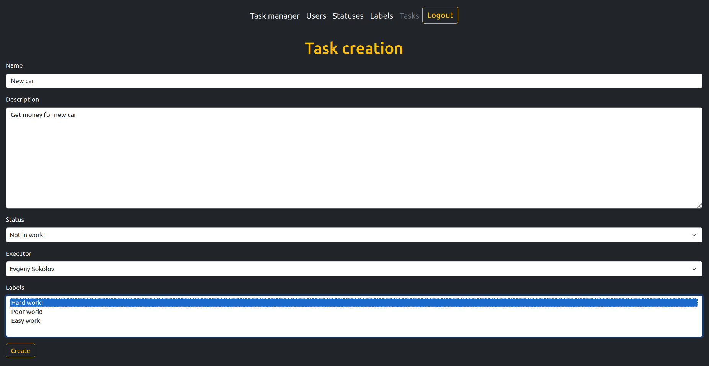
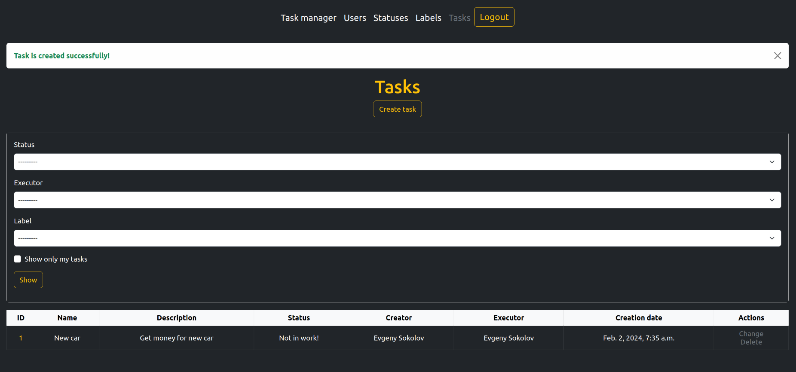

### Hexlet tests and linter status:

---

This is my educational project #4 on the [Hexlet platform](https://hexlet.io) (speciality: Python developer)  

 It represents Task Manager - site with Django backend (using PostgreSQL database) and Bootstrap frontend

Application allows to create tasks with defining of executor, status and labels. It is assumed that in the process of executing a task, all these components can be changed.Database stores all registered users who can act as executor and creator of tasks (authentication is also implemented of course). Each of the entities (user, status, label, task) has its own page with a list of all entities, the ability to create, change and delete. Any of these actions are accompanied by messages. On the most interesting task's page you can conveniently sort the task's list according to specified criteria.

Application is implemented in two languages (en, ru), the language is determined automatically based on system settings.

---

##### :fire: [Working application try here](https://task-manager-25zl.onrender.com/) :fire:

---

:camera: some example pics below :camera:

Main page with project's obout info

---

User registration

---
Login

---

Main page with logged in user

---

Statuses

---
Labels

---
Task creation

---
Tasks with filter

---

##### :fire: [Working application try here](https://task-manager-25zl.onrender.com/) :fire:

